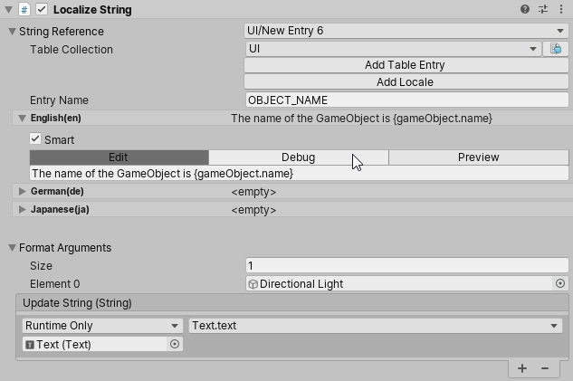
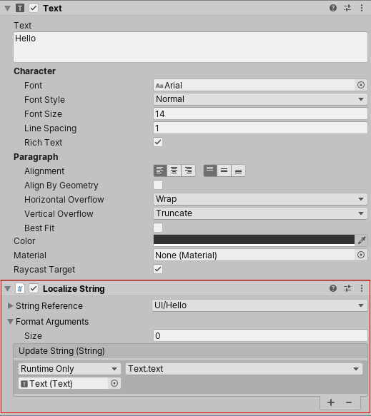

# Component Localizers

Component Localizers are [MonoBehaviours](https://docs.unity3d.com/ScriptReference/MonoBehaviour.html) which can be connected to other components/scripts through [UnityEvents](https://docs.unity3d.com/ScriptReference/Events.UnityEvent.html). Component Localizers allow for localizing without the need to write any scripts.

## LocalizedString

The LocalizedString Component Localizer can be used to localize string components and provide additional arguments when using [Smart Strings](SmartStrings.md) or *String.Format*.
In the inspector, *Format Arguments* must be *UnityEngine.Objects* however it is possible to pass any type through as an argument via script.
The LocalizedString editor can be used to edit tables, localized strings and preview them after formatting.



## LocalizedAssetBehaviour

LocalizedAssetBehaviour can be used to Localize a Unity asset, such as a Texture or Audio clip. LocalizedAssetBehaviour is an abstract class that should be inherited from in order to set the Asset type.
The Localization System currently features some implemented versions of LocalizedAssetBehaviour for **Texture(LocalizeTextureBehaviour)** and **Audio Clip(LocalizeAudioClipBehaviour)**.


This example shows how support could be added for the Sprite asset.

```
using System;
using UnityEngine.Events;

public class LocalizeSpriteBehaviour : LocalizedAssetBehaviour<Sprite>
{
    [Serializable]
    public class UnityEventSprite : UnityEvent<Sprite> { }

    [SerializeField]
    UnityEventSprite m_UpdateAsset = new UnityEventSprite();

    protected override void UpdateAsset(Sprite localizedAsset)
    {
        OnUpdateAsset.Invoke(localizedAsset);
    }
}
```

## Automatic Setup

Some Unity Components can be automatically set up with a Component Localizer. These Components will have a *Localize* option in their context menus. A new Component Localizer will be added and its events hooked up to the target component, when using String Component Localizers the closest table and key will also be selected.



