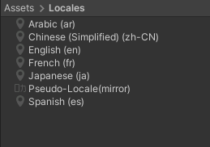
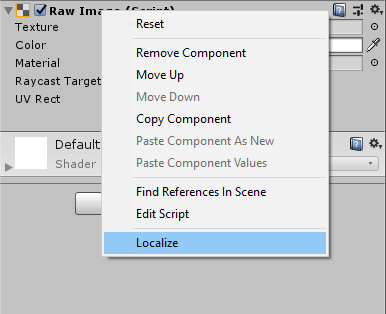
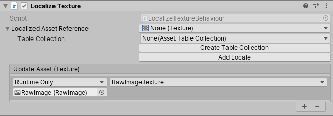
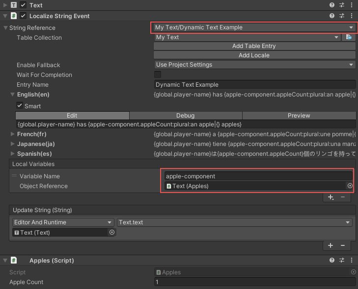

# About Localization
The Localization package provides tools for adding support for multiple languages and regional variants to your application (for example, supporting text in multiple languages or culture-specific Assets such as audio or textures).

# Installing Localization
To install this package, follow the instructions in the [Package Manager documentation](https://docs.unity3d.com/Packages/com.unity.package-manager-ui@latest/index.html). 

# Requirements
This Localization package version *0.3.1* is compatible with the following versions of the Unity Editor:

* 2018.3 and later (recommended)

# Feedback
Localization is still in development and subject to change. Your feedback is welcome [here](https://forum.unity.com/forums/localisation-tools-previews.205/)

# Using Localization

## Localization Settings
The Localization Settings Inspector window is the access point for all things localization-based. It provides an interface to accessing the Project Locales and Asset Tables for the Project.

### Accessing the Settings
To access the Localization Settings navigate to **Edit > Project Settings > Localization.**

If no settings Asset exists, Unity displays a prompt to create one.


You can also create the settings Asset through the Assets menu. Navigate to **Assets > Create > Localization > Localization Settings.**


### Active Settings
You can have multiple Localization Settings Assets per Project, but most use cases only require one. Unity automatically includes the active Localization Settings Asset into the build and loads it during startup, so you do not need to reference it through scripts or add it to a Scene.

### Preload behaviour
The Localization package is built on top of the [Addressable Assets package](https://docs.unity3d.com/Packages/com.unity.addressables@0.4/manual/index.html "Addressable Assets package homepage"). 
By default, Unity stores Localized Assets as AssetBundles. Use the **Preload Behaviour** property to configure how Unity loads these AssetBundles. Unity can load Assets on demand (when it needs them) or preload all of them(for the selected locale) when it initializes the Localization System Preloading allows for immediate access to Assets, at the expense of increased memory usage and initialization time.

### Available Locales
**Available Locales** contains the list of locales that the Project supports when built. 
By default, this uses an *AddressableLocalesProvider*, which uses the Addressable system to fetch Locales. However, you can also create a class that inherits from *LocalesProvider* to completely customize this (see [Scripting Examples](#scripting-examples)).

### Locales
A Locale represents a language and region. It can also contain additional information, such as currency, calendar, and user-added custom data.

Locales wrap the .Net CultureInfo class. However, you can also define a Locale that the CultureInfo class does not support. 

You can create custom Locales to attach additional information. To create a custom Locale, you need to inherit from the Locale class (see [Custom Locale Example](#custom-locales)).

### Locale Generator window
To create a Locale, navigate to **Window > Localization > Locale Generator** or click the *Locale Generator** button in the Available Locales editor.


The Locale Generator provides a set of known Locales that you can select and save to the Project. 

Use the **Locale Source** field to control the source that Unity generates the list of Locales from. These known locales can be gathered from either the CultureInfo class or the Unity SystemLanguage enum.

To select a Locale, tick the check box next to its name. Once you have selected the the Locales you want, click the **Create Locales** button. This saves each Locale as an Asset in the Project.
These Locale Assets can then be added to the Available Locales by clicking the **Add** button or the **Add All** button to add all Locale Assets in the project automatically.

If you are using a custom Locale,  select the custom class from the **Base Class** field to generate Locales of this type instead of the default. 



### Locale Selector
The Locale Selector determines which Locale Unity should use when the application first starts. For example, you might want to use a default Locale, or attempt to use the Locale that the player is using on their device.

By default, Unity uses *StartupLocaleSelectorCollection*. However, you can create a class that inherits from *StartupLocaleSelector* to customize this. 

*StartupLocaleSelectorCollection* allows you to use multiple *StartupLocaleSelectors*. The *StartupLocaleSelectorCollection* queries each selector in the list, starting at the top(index 0). If a selector returns null, then it queries the next, until it finds a valid Locale or it reaches the end of the list. This allows you to create fallback behaviors when Unity is selecting which Locale to use.

By default, the *StartupLocaleSelectorCollection* works in the following way:


### Asset Database
The Asset Database is responsible for retrieving the various Asset Tables. By default, this involves querying and loading through the Addressable Assets system. However, you can fully customize the behaviors by inheriting from the *LocalizedAssetDatabase* class. 

By default, the Asset Database works in the following way:


## Asset Tables
An Asset Table is responsible for returning an Asset when requested via a **Key** (an identifying name or unique id). 
In an Asset Table, one column contains the **Key**, and the other column or columns contain the Asset (or a reference to the Asset such as the GUID) for a selected Locale.

You can create multiple tables per Asset type (for example, you might want to create one table per Scene). It's better to use multiple tables when you need to localize a large number of Assets, but you don't need to access them all at the same time. Using smaller tables can help reduce memory usage, especially when preloading tables.

### Asset Tables Window


To open the Asset Tables window, navigate to **Window > Localization > Asset Tables Editor**. Use this window to is used for create and manage the Project's localization Asset Tables. The window consists of two tabs: 

+ **Create Table:** Use this tab to create new Asset Tables
+ **Edit Table:** Use this tab to make changes to existing Asset Tables within the Project. 

To create an Asset Table, follow these steps:

+ Select the Locales that you want to generate a table for. Unity creates one table per selected Locale.
+ Provide a table name.This is the name you use to refer to the table when querying the Localization Database.
+ Select an existing Key Database to use or leave empty to create a new one. The Key Database is responsible for mapping string keys to unique numeric Id's.
+ Select the Table Type. Each table can only contain one type of Asset (e.g Texture, AudioClip, ScriptableObject).
+ Click Create. This creates an Asset Table Collection, an Asset Table for each Locale.


Once you have created a table, you can edit it in the **Edit Table** tab. Here, you can access all Asset Tables within the project. Use the **Table** dropdown menu to select a table to view and edit. Unity displays the table for editing in the lower portion of the Asset Tables window. Different Asset types have different editors, depending on the type of information they contain.


### Localized Asset Reference

The *LocalizedAssetReference* is a class to provide a simple way to load assets during run time. It features an editor to allow for selecting relevant Asset Tables and key entries from the Project.


The Localized Asset Reference can be used in your own class like so:

```
using System.Collections;
using UnityEngine;
using UnityEngine.Localization;

public class Example : MonoBehaviour
{
    public LocalizedAssetReference assetRef;

    public IEnumerator Start()
    {
        var loadOperation = assetRef.LoadAsset<Texture2D>();

        yield return loadOperation; // Wait for loading.

        // Check the loading was successful.		
        if (loadOperation.Status != AsyncOperationStatus.Succeeded)
        {
            Debug.Log("Loaded Texture: " + loadOperation.Result.name);
        }
    }
}
```

When using a LocalizedAssetDatabase it is possible to reference multiple asset types, if LoadAsset is called with the wrong type then the following error will occur
`InvalidCastException: Cannot cast from source type to destination type.`
 
It is possible to create a *LocalizedAssetDatabase* for a specific asset type instead. This will only allow for a single asset type to be used, this is often the preferable way to work.

For example a Texture2D only version could be created like so:

```
[Serializable]
public class Texture2DAssetReference : LocalizedAssetReferenceT<Texture2D> { };
```

The class could then be used in the same way as the *LocalizedAssetDatabase* only without the need to provide generic type arguments. The editor for the *Texture2DAssetReference* would only allow for keys which reference a Texture2D asset to be used.

```
public class Example : MonoBehaviour
{
    public Texture2DAssetReference assetRef;

    public IEnumerator Start()
    {
        var loadOperation = assetRef.LoadAsset();

        yield return loadOperation; // Wait for loading.

        // Check the loading was successful.
        if (loadOperation.HasLoadedSuccessfully())
        {
            Debug.Log("Loaded Texture: " + loadOperation.Result.name);
        }
    }
}
```


## String Tables
String Tables work in a similar way to Asset Tables, but they contain all of the translated string data within them, and they do not require an additional loading step. 

Each row on a String Table contains a **Key** (the original text), and a string entry for a specified Locale. A string entry supports a translated string, or multiple translated strings when using plurals. The entry also contains an editor-only field for comments. 


### Localized String Reference 

The *LocalizedStringReference* is a class to provide a simple way to load strings during run time. It features an editor to allow for selecting String Tables and string entries from the Project.


### Using AsyncOperationHandle
The localization system is designed so that Unity does not need to hold all localized Assets in memory ready for use, but can instead load them on demand when it needs them, and unload them when it no longer needs them. Because of this, localized Assets might not be immediately available, and Unity might need to load them from disk or fetch them from a server. To facilitate this, Unity uses the AsyncOperationHandle as an interface to all requests. 

When an Asset is not immediately available, the localization system returns an *AsyncOperationHandle*. The *AsyncOperationHandle* provides a Completed event that notifies Unity when the operation has finished. It calls this during *LateUpdate*. If the request has already been completed, such as when the requested data is already loaded from a previous request or during preloading, then the *IsDone* property can be used to check for immediate access through the *Result* property, alternative the Completed event still occurs in the LateUpdate, allowing for all code to follow the same path. You can also yield on an *AsyncOperationHandle* inside of a coroutine.

### Plural support
To enable Plural support for a string, tick the **Plural Mode** tick box. The Localization system follows the [gettext](http://docs.translatehouse.org/projects/localization-guide/en/latest/guide/translation/plurals.html) plural form. 

Use the *PluralForm* class to add translated plural strings to the Plural fields. 

In some languages there is only one plural form, and in others there are multiple. For example, the English language contains 2 forms for a word: one for singular, and one for plural. When there is more than one of an item, you add an *s* to the end of the word (for example, the plural of *file* is *files*). You can use the PluralForm class to determine how many plurals the selected Locale supports.

The *PluralForm Evaluator* delegate determines which Plural entry to use for each language. The following example demonstrates the *Evaulator* code for the English language:

```
new PluralForm()
{
	NumberOfPlurals = 2,
	Evaluator = n => n != 1 ? 1 : 0
};
```

The Evaluator identifies the index of the plural entry to use. In this case, it only returns index 0 when the value is 1; for any other value it returns the index of 1.

For the *file/s* example, you might set it up so that the plural entry contains the following values:

[0] `{0} File`

[1] `{0} Files`

The Evaluator would then return the translated plural like so:

```
var translatedText = LocalizationSettings.StringDatabase.GetLocalizedString("ID_FILE", numFiles);
Debug.Log("Translated Text: " + translatedText);
```

# Tutorial 

This tutorial guides you through setting up a simple Project with localized Assets and strings.
## 1. Create the Localization Settings 

The Project's Localization Settings is an Asset. To create this Asset, go to **Assets > Create > Localization > Localization Settings**.

When you create the Asset, Unity displays a prompt to ask whether you want to make this the active localization settings Asset. Select OK to add the Asset as a [ConfigObject](https://docs.unity3d.com/2018.2/Documentation/ScriptReference/EditorBuildSettings.AddConfigObject.html). Unity automatically uses these settings, and includes them into any builds as a preloaded Asset.

## 2. Create Locales

Locales represent regions; they determine which language you are localizing your application to, and other localization decisions.

To open the Locale Generator window, navigate to the Localization Settings (menu: Edit > Project Settings > Localization) and click the **Locale Generator** button, or go to **Window > Localization > Locale Generator**. 

To select a Locale, tick the toggle box next to its name. Tick the checkbox next to the Locale you want to add, then click the **Create Locales** button and select where you want to save the Assets to. 


## 3. Choose a default Locale

Use the Locale Selector to determine which Locale your application uses by default. To do this, add the Locale to the **Default Locale Selector** field. Your application uses this Locale on start-up, and when no other Locale is selected.


## 4. Add a Locale selection menu

Players need a way to select the Locale they want to use in the game. To add a UI Dropdown menu to the Scene, go to **GameObject > UI > Dropdown**, and attach the following script:

```
using System.Collections;
using System.Collections.Generic;
using UnityEngine;
using UnityEngine.Localization;
using UnityEngine.UI;

public class LocaleDropdown : MonoBehaviour
{
    public Dropdown dropdown;

    IEnumerator Start()
    {
        // Wait for the localization system to initialize, loading Locales, preloading etc.
        yield return LocalizationSettings.InitializationOperation;

        // Generate list of available Locales
        var options = new List<Dropdown.OptionData>();
        int selected = 0;
        for(int i = 0; i < LocalizationSettings.AvailableLocales.Locales.Count; ++i)
        {
            var locale = LocalizationSettings.AvailableLocales.Locales[i];
            if (LocalizationSettings.SelectedLocale == locale)
                selected = i;
            options.Add(new Dropdown.OptionData(locale.name));
        }
        dropdown.options = options;

        dropdown.value = selected;
        dropdown.onValueChanged.AddListener(LocaleSelected);
    }

    static void LocaleSelected(int index)
    {
        LocalizationSettings.SelectedLocale = LocalizationSettings.AvailableLocales.Locales[index];
    }
}
```


## 5. Texture Localization: Create an Asset Table
There are many reasons you might need to localize an Asset. For example, you might want to play a different piece of voiceover audio or music, or change a texture that contains written text (such as a signpost). The localization system uses Asset Tables to support this. 

This walkthrough demonstrates changing an Asset's Texture to the flag of that Locale's country.

First, you need to create a Texture Asset Table. To do this, open the **Asset Tables** window (menu: **Window > Localization > Asset Tables Editor**).

In the Asset Tables window, select the **New Table** tab. Select which Locales you want to generate tables for, give the table a name, leave the Key Database field blank and select the table type (for this tutorial, select **Texture 2D Asset Table**). 

Finally select **Create** to generate the Asset Table Assets.


Click **Edit Table** and select the **My Textures** table. 

A table contains a **Key** field and a value field for each Locale. Unity uses the Key to identify the localized Asset. For this tutorial, name the Key **Country Flag** and use + button to add the key entry.

Select the Texture you want Unity to display for each Locale, and then drag and drop it into the corresponding section of the table, like so:


## 6. Texture Localization: Use the localized Asset
There are multiple ways for Unity to access a localized Asset. This tutorial use components provided by the localization system, so you do not need to write any scripts.

Add a **Raw Image** component to the Scene. To do this, go to **GameObject > UI > Raw Image**. To localize a Raw Image component, right-click the component and then click **Localize**.



This adds a new component called **Localize Texture 2D**. This is a generic localization component. When you add it via the **Localize** option, Unity automatically configures it to localize that component. 



Use the **Asset Reference** field to select the **Country Flag** Key you added to the Texture Asset Table previously.


Run the Scene and use the Locale selection dropdown to change the **Locale**. If everything is configured correctly, the country flag changes to the assigned Texture in the Asset Table.

## 7. Audio Localization: Use the localized Asset
To localize Audio Clips, follow the same process as localizing Texture files:

1. Create a new Asset Table (this example names the Asset Table for Audio *My Audio*).
2. Add a new Key (this example uses *National Anthem*) and assign Audio Clips for each Locale.
3. Add the audio source GameObject (menu: GameObject > Audio > Audio Source).
4. Right-click the Audio Source component and click Localize.
5. Select the Asset reference for the Audio Clip.


## 8. String Localization: Create a String Table

To create a String Table, open the **New Tables** tab and select the String Table type.


To create a String Table, provide a Key (the first Key in this example is *Goodbye*), and use the + button to add the key entry. 

There are two ways to edit the Key values: By default, when you select a value from the table, Unity opens a panel for editing the Key and value.


The toolbar contains a search field(1), a button to toggle multi line editing(2) and a button to toggle inline editing(3).


You can also use the toolbar button to enable in-line editing. This mode is slightly faster, but does not support Plurals.

In-line editing can be enabled to allow editing directly into the table instead of via the panel, this mode is slightly faster, but does not currently support [Plurals.](#Plural-support)


Sometimes you might need to display a string of text that is different depending on certain numeric values. For example, in the English language, when there is more than one of an item, you often add an *s* to the end of the word (for example, the plural of *apple* is *apples*)

Some languages have multiple ways of handling plurals, and some have no plural forms at all. 

To enable plural forms, tick the **Plural Mode** check box. Once enabled each Locale displays the correct number of plural forms for that language. You can then add a plural, and the format operator **{0}** to provide the plural value during translation.


## 9. String Localization: Use String Tables

To add a UI Text element to the Scene, go to **GameObject > UI > Text**.

Right-click the Text component and select the **Localize** option. Unity adds a **Localize String** component and automatically configures it for the GameObject it is attached to. If the Text component contains a string value that is also in a String Table, then Unity automatically assigns this during the setup. If it does not, you can assign a value using the **String Reference** field pop-up in the same way you select a Texture 2D and Audio clip.




## 10. Build Preview and configuration
The Addressables player content must be built in order to use the localized assets in the player.
This can be done through the Addressables window **Window/Asset Management/Addressable Assets** by clicking **Build/Build Player Content**.
The Addressables window can also be used to control how the assets will be packaged and hosted(such as local storage or via a remote web server).


# Scripting examples

## Built-in Locale Provider
The default Locale Provider uses the Addressables system to provide the available Locales at run time. The benefit of this is that you can add and remove Locale support to a project after you build it, and you can defer loading to reduce the application startup time. 

You might need to prevent users from modifying the Locale, or you might not want to use AssetBundles or Addressables. This example demonstrates how to create and use a Custom Locales Provider instead of the default.

```
using System.Collections.Generic;

namespace UnityEngine.Localization.Samples
{
    [CreateAssetMenu(menuName = "Localization/Examples/Custom Locale Provider")]
    public class CustomLocalesProvider : LocalesProvider
    {
        [SerializeField] List<Locale> m_Locales = new List<Locale>();

        public override List<Locale> Locales
        {
            get { return m_Locales; }
            set { m_Locales = value; }
        }
    }
}
```

To create a Custom Locales Provider, navigate to **Assets > Create >  Localization > Examples > Custom Locale Provider**.


Drag the new Custom Locale Provider Asset into the Localization Settings window and add it to the **Available Locales** field. This instructs Unity to use the Custom Locales Provider.


## Adding Support for a new Asset type

You can add localization support to any Unity Asset type. The following example demonstrates how to add and localize a new Asset type.

The new Asset type in this example holds Locale-specific information.

```
using UnityEngine;

[CreateAssetMenu()]
public class Continent : ScriptableObject
{
    public string continentName;
    public float areaMillionKm2;
    public float populationSizeInBillions;
}
```

```
using UnityEngine.Localization;

public class ContinentAssetTable : AddressableAssetTableT<Continent> {}
```


Finally, create a custom editor, so that you can edit the table inside the **Asset Tables** window in Unity. Add this script to an Editor folder or assembly.

```
using UnityEditor;
using UnityEditor.Localization;

[CanEditMultipleObjects]
[CustomEditor(typeof(ContinentAssetTable), true)]
public class ContinentAssetTableEditor : LocalizedAssetTableEditor<Continent> { }
```

This creates a default editor for the Asset Table. To create custom editors, override the *CreateInspectorGUI* method.


## Custom Locales

It is possible to create custom Locales by inheriting from the **Locale** class. For example, a custom Locale could be used to attach additional data specific to each Locale. The Localization system fully supports custom Locales and the **Locale Generator Window** can generate Locales using a Custom Locale class by selecting it from the **Base Class** field.

```
namespace UnityEngine.Localization.Samples
{
    // A custom locale that supports adding an icon for each locale. This could then be used in the language selection menu.
    public class LocaleWithIconExample : Locale
    {
        public Texture2D localeIcon;
    }
}
```


## Document revision history

|Date|Reason|
|---|---|
|Jan 15, 2018|Document created. Matches package version 0.1.0|
|Dec 11, 2018|Document updated for 0.2.0, public preview release|
|May 01, 2019|Document updated for 0.3.0, public preview release|

